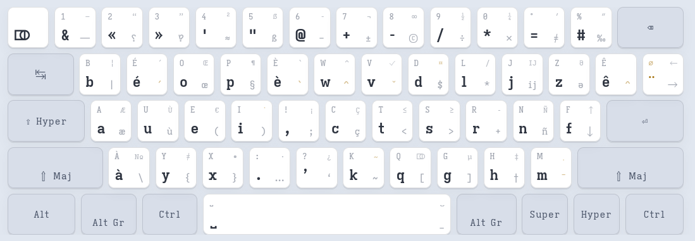

# Programmer Béop

Ergonomic keyboard layout based on [bépo](https://bepo.fr), designed for
French, English, and programming.

**Interactive demo and documentation: <https://luxcem.github.io/programmer-beop/>**



## Rationale

Bépo is excellent for long-form French text, but programming and system
administration demand keys it places poorly: braces, brackets, chevrons.
Programmer Béop moves those characters — and a few frequent English
letters — to reachable positions, while staying close to bépo.

## Features

- **Pairs on Alt Gr** — `( )` `{ }` `< >` `[ ]` on the strong keys
  e i y x t s q g, grouped as pairs.
- **French typography** — `’ « » “ ” …` within direct or easy reach;
  typographic apostrophe by default.
- **Symbols grouped** — `$ # &` within reach; the semicolon moves to
  Alt Gr and spares the pinky.
- **Currency and Greek compose** — `¤` then `l` → £, `b` → ₿;
  `μ` then `a` → α, `l` → λ, `p` → π.
- **Dead or literal** — diacritics that matter in code come in both
  flavours: literal `~` (paths, code) and dead `~` (ñ); literal `` ` ``
  (backticks) and dead `` ` `` (accents).
- **Rethought modifiers** — Ctrl ↔ Alt for shortcuts under the thumb;
  Caps Lock and Menu become Hyper (Mod3), distinct from Super.

## Comparison

Scored with the [Keyboard Layout Analyzer](https://patorjk.com/keyboard-layout-analyzer/)
over four corpora (best score in bold):

| Corpus | Programmer Béop | Bépo | Programmer Dvorak | Qwerty | Azerty |
|---|---|---|---|---|---|
| [Les Misérables (fr)](https://patorjk.com/keyboard-layout-analyzer/#/load/Gj1cS8s6) | **67.51** | 65.82 | 63.07 | 51.57 | 47.98 |
| [Alice in Wonderland (en)](https://patorjk.com/keyboard-layout-analyzer/#/load/Zd77pwRK) | **66.77** | 60.48 | 66.11 | 53.06 | 49.54 |
| [runserver.py (Python)](https://patorjk.com/keyboard-layout-analyzer/#/load/72DSk2dX) | **53.94** | 52.77 | 52.26 | 43.92 | 42.01 |
| [pack-next.ts (TypeScript)](https://patorjk.com/keyboard-layout-analyzer/#/load/qL9x1qX0) | **48.09** | 45.92 | 47.89 | 37.36 | 33.03 |

## Installation

### Linux (X11)

Copy (or symlink) the `linux` folder to `~/.xkb`, then:

```sh
setxkbmap -I $HOME/.xkb prbeop-fren -print | xkbcomp -I$HOME/.xkb - $DISPLAY 2>/dev/null
```

Add this command to your X session startup (`~/.xinitrc`, i3 config, ...)
to make the layout persistent. Symlink `linux/XCompose` to `~/.XCompose`
for the currency and Greek compose sequences.

### Linux (Wayland)

Wayland compositors load XKB layouts through libxkbcommon, which picks
up custom layouts from `~/.config/xkb`:

```sh
mkdir -p ~/.config/xkb/symbols
cp linux/symbols/prbeop-fren ~/.config/xkb/symbols/
cp linux/XCompose ~/.XCompose
```

Then select the layout in your compositor, for example in sway:

```
input type:keyboard {
    xkb_layout "prbeop-fren"
}
```

This works on wlroots compositors (sway, Hyprland, river, ...). GNOME
and KDE do not read `~/.config/xkb`; for those, copy
`linux/symbols/prbeop-fren` to `/usr/share/X11/xkb/symbols/` and
register it in the rules files.

The modifier remapping (Caps as Hyper, swapped Ctrl/Alt, Alt Gr on both
left Win and right Alt) is fully defined in the symbols file and works
identically on X11 and Wayland.

### macOS

The layout installs with [Ukelele](https://software.sil.org/ukelele/)
for the characters and
[Karabiner-Elements](https://karabiner-elements.pqrs.org/) for the
modifiers (Ctrl ⇄ Alt, Caps as Hyper):

```sh
cp macos/PrBeop.keylayout ~/Library/Keyboard\ Layouts/
cp macos/karabiner.json ~/.config/karabiner/
# then System Settings → Keyboard → Input Sources
```

## Tools

The `tools` folder contains a [Klavaro](https://klavaro.sourceforge.io/)
layout file for typing practice and the
[Keyboard Layout Analyzer](https://patorjk.com/keyboard-layout-analyzer/)
configuration used for the comparison above.

## License

[GPL-3.0](LICENSE)
